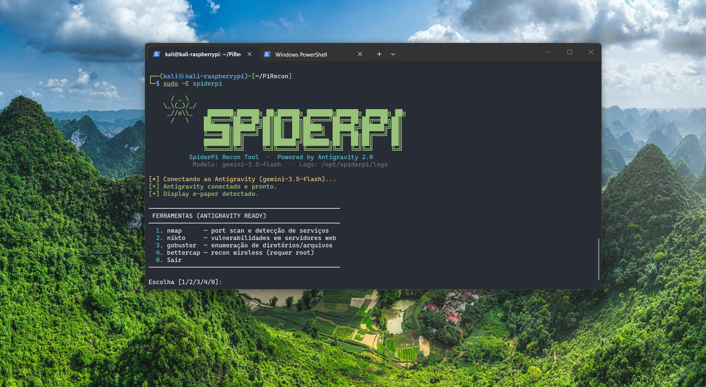
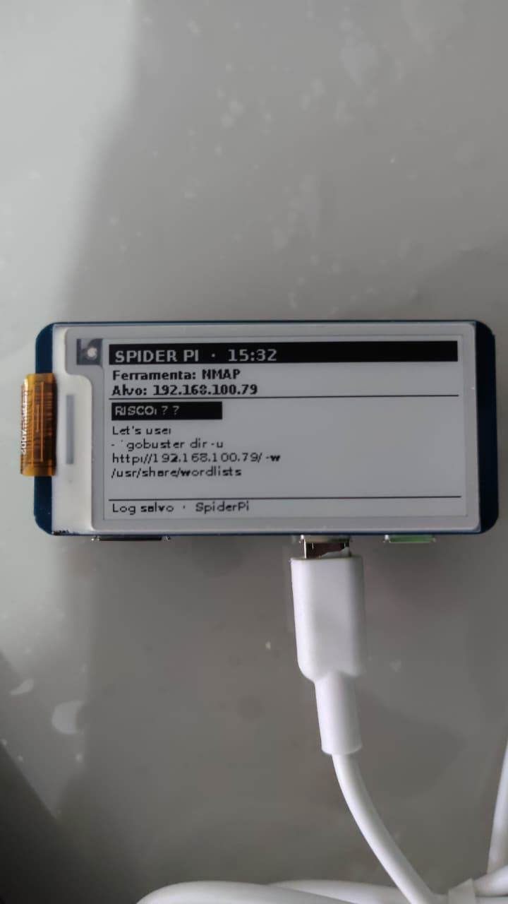
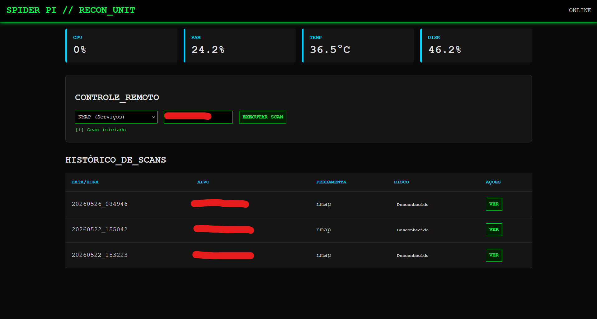
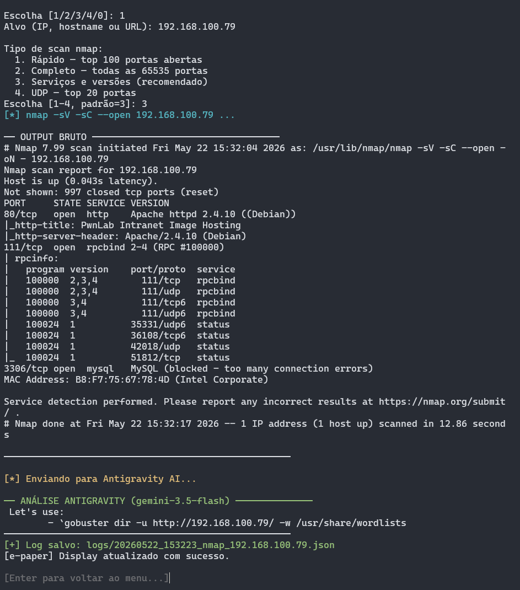

<!-- ===================================== -->
<!--        SPIDERPI RECON PLATFORM        -->
<!-- ===================================== -->

<p align="center">
  
  
</p>

<p align="center">
  
  
  
  
</p>

---

# SpiderPi 🕷️ — Powered by Antigravity 2.0
**Ferramenta de reconhecimento de segurança com análise via Antigravity AI (Gemini 3.5 Flash)**
Para Raspberry Pi Zero 2W com display Waveshare e-paper



---

## Estrutura do Projeto

```
spiderpi/
├── web/                # Interface Web (Flask/Dashboard)
│   ├── app.py          # Backend do dashboard
│   ├── static/         # CSS e assets web
│   └── templates/      # Templates HTML
├── scanner.py          # Script principal — menu e integração Antigravity
├── epaper_display.py   # Driver do display Waveshare (v2.0)
├── setup.sh            # Instalação automatizada
├── KALI_INSTALL.md     # Guia de instalação do Kali Linux (Headless)
├── logs/               # JSONs com histórico de scans
└── README.md
```

---

## 📚 Documentação Detalhada

Para facilitar a navegação, o projeto está dividido nos seguintes guias:

1.  **[Guia de Instalação (KALI_INSTALL.md)](KALI_INSTALL.md)**: Como preparar o Raspberry Pi Zero 2W com Kali Linux Headless.
2.  **[Guia de Uso (USAGE.md)](USAGE.md)**: Detalhes sobre os comandos CLI, flags de automação e o Dashboard Web.

---

## 🛠️ Instalação Rápida

```bash
# 1. Clone ou copie os arquivos para o Pi
scp -r spiderpi/ pi@raspberrypi.local:~/

# 2. No Pi, execute o setup (requer root)
ssh pi@raspberrypi.local
cd ~/spiderpi
chmod +x setup.sh
sudo ./setup.sh

# O setup.sh criará um ambiente virtual (venv) e instalará o SDK 'google-genai'.
# Também será criado um alias 'spiderpi' para facilitar o acesso e um serviço systemd
# para mostrar uma tela de boot no e-paper.

# 3. Configure a API Key (Plataforma Antigravity / Google AI Studio)
# Acesse: https://aistudio.google.com/app/apikey
# Para Zsh (padrão no Kali):
echo 'export GEMINI_API_KEY="sua_chave_aqui"' >> ~/.zshrc
source ~/.zshrc

# Para Bash:
echo 'export GEMINI_API_KEY="sua_chave_aqui"' >> ~/.bashrc
source ~/.bashrc
```

---

## Diagnóstico do Display

Se o display não estiver exibindo imagens ou você receber o erro `Driver não disponível`, utilize o script de diagnóstico:

```bash
# Navegue até a pasta do projeto e execute:
sudo python3 test_epaper.py
```

O script verificará:
- Se a interface SPI está habilitada.
- Se as bibliotecas Python (Pillow, RPi.GPIO, spidev) estão instaladas.
- Se os drivers específicos da Waveshare foram baixados corretamente.
- Permite realizar um teste de desenho (flash) na tela.



---

## Configuração do E-Paper

Edite `epaper_display.py` e altere `DISPLAY_MODEL` para o seu modelo:

| Modelo Waveshare | Valor em DISPLAY_MODEL |
|---|---|
| 2.13" V4 (padrão Pwnagotchi) | `epd2in13_V4` |
| 2.7" | `epd2in7` |
| 3.7" | `epd3in7` |
| 4.2" | `epd4in2` |

---

## Uso

```bash
# Modo padrão
spiderpi

# Modo Root (necessário para wireless/bettercap)
# Use -E para passar as variáveis de ambiente (como GEMINI_API_KEY)
sudo -E spiderpi
```

### Interface Web (Dashboard)
O SpiderPi possui um painel de controle que inicia **automaticamente** em background após a instalação:



- Acesse: `http://raspberrypi.local:5000` (ou o IP do seu dispositivo)

### Modos de Uso
O SpiderPi agora suporta operação híbrida (CLI + Web):

1. **Modo Interativo (Menu):**
   ```bash
   sudo -E spiderpi
   ```
2. **Modo Direto (Flags/Automação):**
   ```bash
   sudo -E spiderpi --tool nmap --target 192.168.1.1
   ```
3. **Dashboard Web:**
   Inicie e visualize scans diretamente pelo navegador.

Para um guia detalhado de todos os comandos e ferramentas, veja o **[Guia de Uso (USAGE.md)](USAGE.md)**.

### Fluxo de uso:
1. Escolha a ferramenta no menu.
2. Informe o alvo (IP, hostname ou URL).
3. O scan executa e o output é processado.
4. O **Antigravity AI** analisa os resultados em tempo real.
5. O display e-paper mostra o resumo crítico.
6. Log JSON completo salvo em `logs/`.

---

## Exemplo de Análise (Antigravity 2.0)

```
── ANÁLISE ANTIGRAVITY (gemini-3.5-flash) ──
RESUMO: Alvo expõe SSH e HTTP. Apache 2.4.38 detectado com falhas críticas de segurança.

VULNERABILIDADES:
- Apache 2.4.38: CVE-2019-0211 (Privilege Escalation)
- SSH: Versão antiga (7.9p1) — vulnerável a enumeração de usuários.

PRÓXIMOS PASSOS:
1. nikto -h http://192.168.1.10
2. searchsploit apache 2.4.38
3. hydra -l user -P passlist.txt ssh://192.168.1.10

RISCO GERAL: Crítico
```



---

## Logs e Histórico

Cada scan gera um arquivo JSON rico em metadados:

```json
{
  "timestamp": "20260520_143022",
  "target": "192.168.1.10",
  "tool": "nmap",
  "model": "gemini-3.5-flash",
  "analysis": "..."
}
```

---

## Custo e Limites

O Antigravity utiliza o tier de API do Google AI Studio:
- **Gemini 3.5 Flash:** Gratuito até 1.000 requisições/dia.
- Ideal para operadores de campo e laboratórios de pesquisa.

---

## Requisitos de Hardware

- Raspberry Pi Zero 2W (ou superior)
- Display Waveshare e-paper
- Kali Linux ARM ou Raspberry Pi OS (64-bit recomendado)

---

## ⚠️ Aviso Legal

Esta ferramenta é destinada exclusivamente para fins educacionais e testes de penetração autorizados. O uso em redes sem permissão é ilegal.
